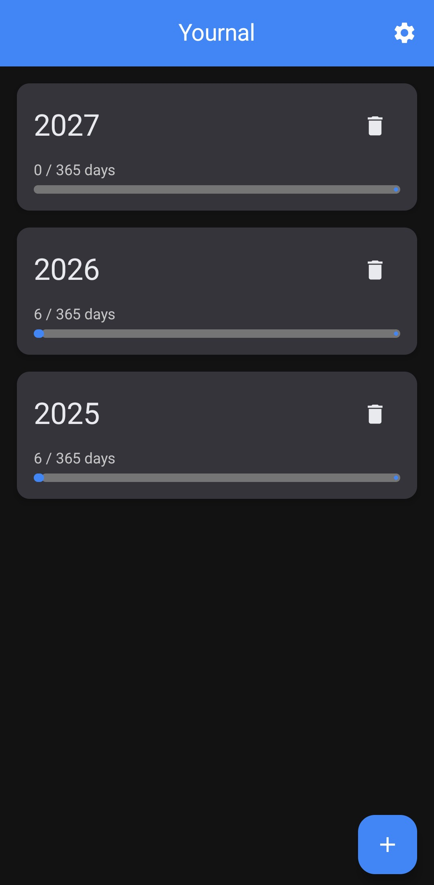
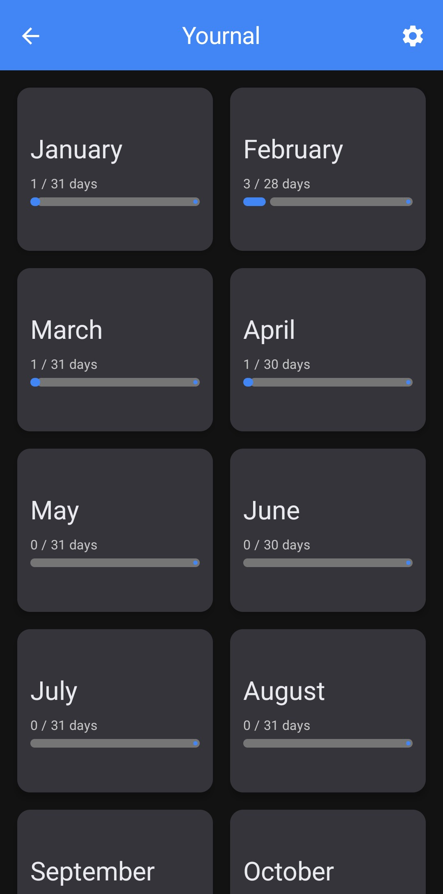
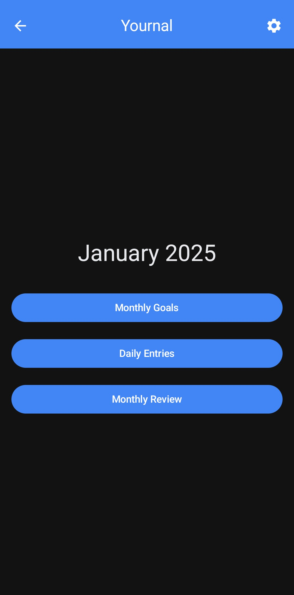
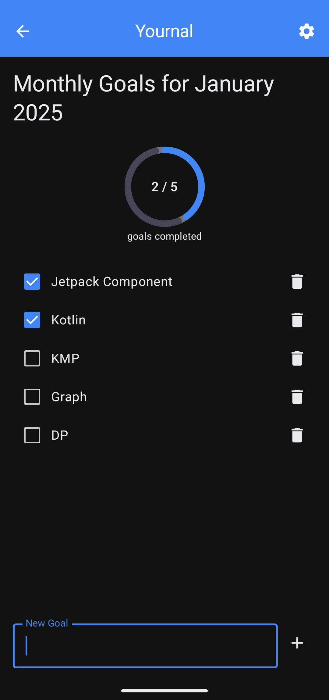
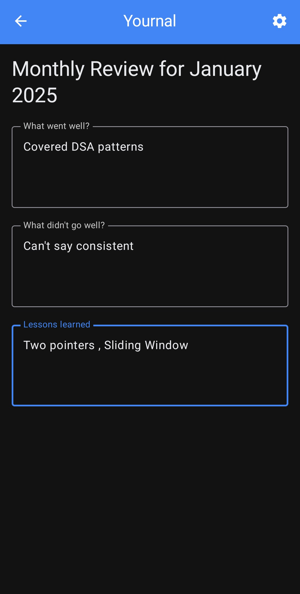
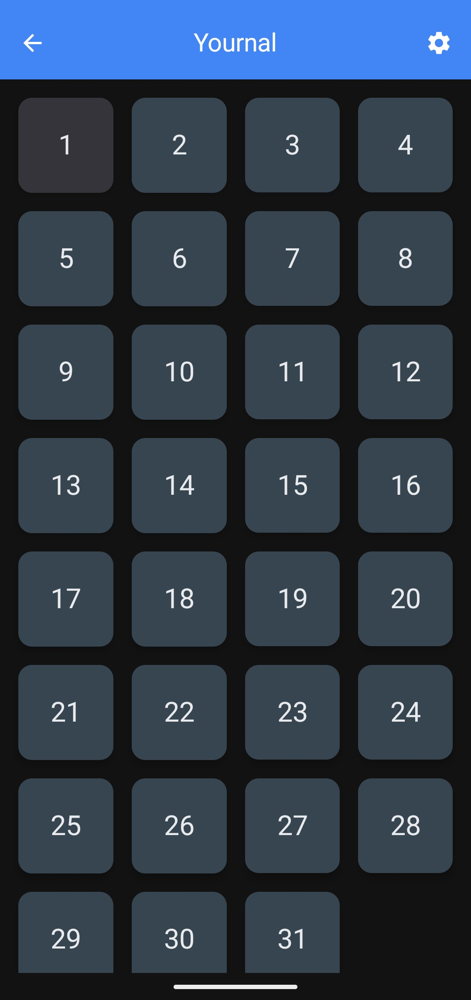
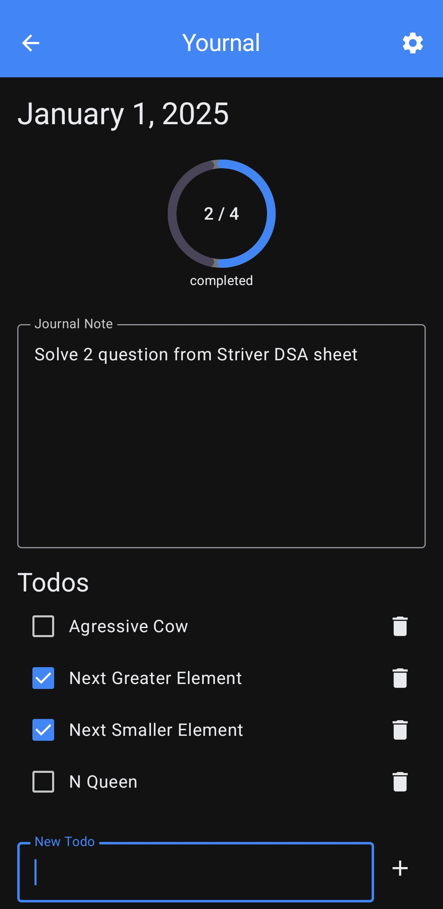
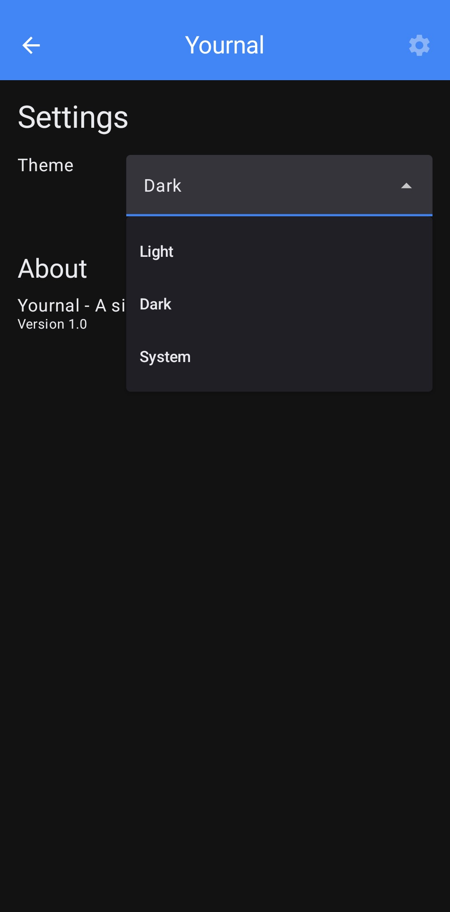

# Yournal - Offline Journaling & Goal Tracking Android App

This is an offline-first Android journaling app built using **Kotlin, Jetpack Compose, Room Database, and DataStore**. The app lets users maintain a structured Year → Month → Day journal, set monthly goals, reflect on them with monthly reviews, and track daily to-dos — all fully offline, with no account required.

---

## 🚀 Features

✅ **Hierarchical Journaling** - Navigate your journal by Year → Month → Day.
✅ **Daily Entries** - A dedicated entry screen for each day's journal.
✅ **Daily To-Dos** - Lightweight task tracking alongside your daily entries.
✅ **Monthly Goals** - Set goals for the month ahead.
✅ **Monthly Review** - Reflect on the month against the goals you set.
✅ **Persisted Settings** - User preferences saved via Jetpack DataStore.
✅ **Fully Offline** - All data stored locally with Room; no network dependency, no account needed.

---

## 🛠️ Technologies Used

- **Kotlin** (Programming Language)
- **Jetpack Compose** (Material 3, declarative UI)
- **MVVM Architecture** (per-screen ViewModels + shared Repository)
- **Room Database** (local persistence for entries, goals, reviews, to-dos)
- **Jetpack Navigation (Compose)** (screen-to-screen navigation)
- **DataStore Preferences** (settings persistence)
- **KSP** (Room annotation processing)

---

## 📸 Screenshots

<p align="center">
  
  
  
  
</p>
<p align="center"><em>Year Selection · Month Selection · Month Detail · Monthly Goal</em></p>

<p align="center">
  
  
  
  
</p>
<p align="center"><em>Monthly Review · Daily Entry · Day Entry · Settings</em></p>

---

## 📋 Setup Instructions

### 1️⃣ Clone the Repository

```bash
git clone https://github.com/ShivamVerma19/Yournal.git
```

### 2️⃣ Open in Android Studio

- Open Android Studio.
- Click on "Open an existing project" and select the cloned folder.
- Let Gradle sync (min SDK 24, target/compile SDK 36).

### 3️⃣ Run the App

- Click **Run ▶** in Android Studio to launch on an emulator or device.
- No API keys or backend setup required — the app works fully offline out of the box.

---

## 🔗 How It Works

### Navigating the Journal

- Users start at **Year Selection**, drill into a **Month**, and from there into individual **Day Entries**.
- Each level is backed by its own `ViewModel`, sharing a single `YournalRepository` underneath.

### Storing Entries

- Daily entries, to-dos, monthly goals, and monthly reviews are each modeled as Room entities (`DailyEntry`, `DailyTodo`, `MonthlyGoal`, `MonthlyReview`, `YearEntity`).
- All reads/writes go through `YournalDao`, wrapped by `YournalRepository`.

### Monthly Goals & Review Loop

- Users set goals for a month via the **Monthly Goals** screen.
- At month's end, the **Monthly Review** screen surfaces those goals for reflection.

### Settings

- User preferences are persisted independently via Jetpack **DataStore**, decoupled from the Room-backed journal data.

---

## 🔥 Future Enhancements

✅ Export/backup journal data.
✅ Reminders/notifications for daily entries.
✅ Search across past entries.

---

## 💡 Contributors

**Shivam Verma** - [GitHub](https://github.com/ShivamVerma19)
